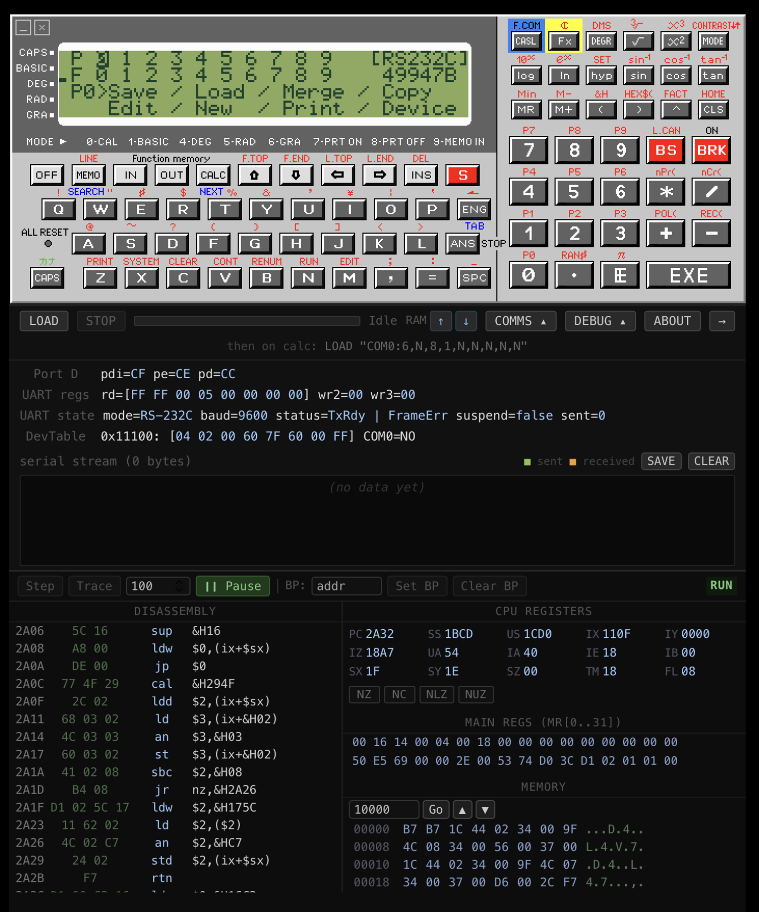

# FX-870P Emulator

A browser-based emulator for the **Casio FX-870P** (also sold as the VX-4) pocket computer, written in TypeScript and Vue 3.

The FX-870P was a 1986 programmable calculator running a **Hitachi HD61700** CPU at 921 kHz with a 96×64 pixel LCD, 
83-key keyboard, serial port, and optional MD-120 floppy drive. This emulator is a full port of the 
original Delphi reference implementation to the web platform.



## Credits

The original emulator is available on the [PISI](https://www.pisi.com.pl/piotr433/index.htm#fx870) and credit 
is given to the original author of the amazing suite of emulators available on this site. This implementation is 
designed to purely make the code behind that emulator available to a wider audience on the internet.

This version of the emulator implemented by [Mark Wickens](https://urbancamo.github.com) and is hosted 
on GitHub [here](https://github.com/urbancamo/fx870p-emulator/).

## Limitations

IO is not yet implemented in any capacity. This is a work in progress. I'm also planning on implementing direct
keyboard entry - at the moment you have to use the mouse to click the keyboard buttons directly.

---

## Hardware Emulated

| Component | Details                                                                               |
|-----------|---------------------------------------------------------------------------------------|
| CPU       | Hitachi HD61700, 921 kHz                                                              |
| Memory    | 18-bit address space: ROM0 (6 KB, 16-bit words), ROM1 (128 KB × 2 banks), RAM (64 KB) |
| Display   | HD44352A01 LCD controller — 96×64 pixels + 5 status indicators                        |
| Keyboard  | 83-key matrix (9 blocks, 16 KO columns)                                               |
| Serial    | UART with XON/XOFF flow control                                                       |
| Storage   | MD-120 floppy disk via Origin Private File System (OPFS)                              |

---

## Running

### Prerequisites

- Node.js 22 LTS
- ROM files placed in `public/roms/` (not included)

### Development server

```bash
npm install
./start.sh        # starts on http://localhost:3007/fx870p-emulator/
./stop.sh         # stops the server
```

Or use npm directly:

```bash
npm run dev       # foreground, Ctrl-C to stop
```

### Production build

```bash
npm run build     # output in dist/
npm run preview   # preview the built app
```

The app is served under the `/fx870p-emulator/` base path in both dev and production.

---

## Project Structure

```
src/
  emulator/
    cpu.ts          HD61700 CPU core — reset, fetch/decode/execute loop
    exec.ts         Instruction handlers (~2100 lines)
    decoder.ts      256-entry instruction dispatch table
    def.ts          CPU state, memory map, srcRead/dstWrite
    lcd.ts          HD44352A01 LCD controller → Canvas ImageData
    keyboard.ts     83-key matrix — keydown + mouse events
    port.ts         I/O ports and UART state machine
    comm.ts         RS-232C TX/RX queue, XON/XOFF
    fdd.ts          MD-120 floppy disk (OPFS-backed)
    emulator.ts     Main rAF loop, ROM loading, state persistence
    remote-log.ts   Debug logging (dev only)
  components/
    EmulatorView.vue    Top-level orchestrator
    LcdCanvas.vue       Canvas LCD renderer
    KeyboardOverlay.vue Clickable key hit regions over face.png
    CommPanel.vue       Serial/debug panel
public/
  images/face.png   Calculator faceplate graphic
  roms/             ROM and charset binaries (not in repo)
reference/          Documentation and Delphi source
docs/               Implementation notes
tools/dis.ts        Standalone disassembler (npm run dis)
```

---

## Reference Documents

| Document | Description |
|---|---|
| [`reference/fx870p-rom-annotations.md`](reference/fx870p-rom-annotations.md) | Annotated ROM address labels and call-flow notes |
| [`reference/fx870p-roms.md`](reference/fx870p-roms.md) | Full ROM disassembly |
| [`reference/FX-870P_VX-4 Manual.html`](<reference/FX-870P_VX-4 Manual.html>) | Original user manual (HTML) |
| [`docs/CasioVX-4-Manual-Peter-Rost.pdf`](docs/CasioVX-4-Manual-Peter-Rost.pdf) | VX-4 manual by Peter Rost (PDF) |
| [`docs/FX-870P emulator.pdf`](<docs/FX-870P emulator.pdf>) | Delphi emulator documentation (PDF) |
| [`docs/plan.md`](docs/plan.md) | Web port implementation plan and component mapping |
| [`reference/fx870_es/`](reference/fx870_es/) | Original Delphi 5 source (reference only) |

---

## Testing

The emulator has a headless test suite powered by [vitest](https://vitest.dev/) that boots the emulator in Node.js, injects keystrokes, runs the CPU, and verifies LCD output.

### Run all tests

```bash
npm test
```

### Run a single test file

```bash
npx vitest run tests/sin90.test.ts
```

### Run tests matching a name pattern

```bash
npx vitest run -t "SIN"
```

### Watch mode (re-runs on file changes)

```bash
npx vitest
```

Tests require ROM files in `public/roms/` (same as the dev server).

---

## Debug Logging

The dev server exposes a `/fx870p-emulator/log` endpoint that writes to `emulator-debug.log`.

1. Start the dev server
2. Open the app and click **Log** (turns red) before clicking **Fresh Start**
3. Wait ~3 seconds for boot to complete
4. Click **Log** again to flush and stop
5. Inspect `emulator-debug.log`

---

## Tech Stack

- [Vue 3](https://vuejs.org/) + [`<script setup>`](https://vuejs.org/api/sfc-script-setup.html)
- [TypeScript](https://www.typescriptlang.org/)
- [Vite 7](https://vite.dev/)