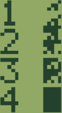

# User Defined Characters

The characters between `CHR$(252)` and `CHR$(255)` are user-defined.
The command `DEFCHR$` is used to define the bits of the character.

The chars 252 to 255 of the Casio's character table allow redefining using the
`DEFCHR$` command by using five two-digit hex values for the five pixel columns,
e.g. `DEFCHR$(255)="FF00FF00FF"` for vertical lines.

For example, given the following program:

```
10 CLEAR
20 DIM C$(4)
30 C$(1)="0123456789"
40 C$(2)="9ABCDEF012"
50 C$(3)="FEDCBA9876"
60 C$(4)="FEFEFEFEFE"
70 FOR A=1 TO 4
80 DEFCHR$(A+251)=C$(A)
90 PRINT A; CHR$(A)
100 NEXT A
```

The user defined characters are as follows:



Another example:

```
10 CLEAR
20 DIM C$(4)
30 C$(1)="11224488FF"
40 C$(2)="11224488AA"
50 C$(3)="BBCCDDEEFF"
60 C$(4)="0000000000"
70 FOR A=1 TO 4
80 DEFCHR$(A+251)=C$(A)
90 PRINT A; CHR$(A)
100 NEXT A
```


